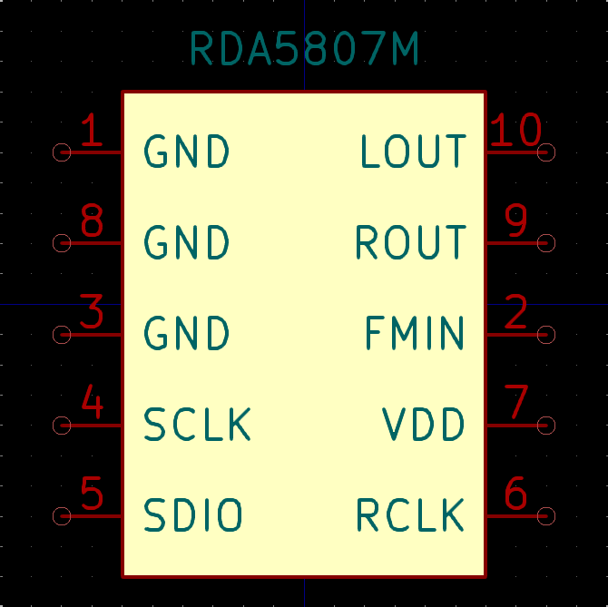
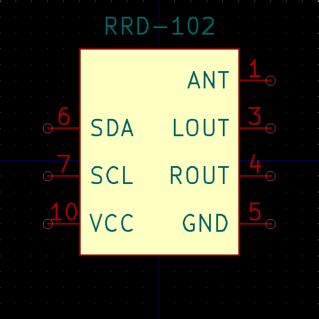

# Hardware symbols and footprints

## RDA5807M 

### Symbol
Included in the `RDA5807.kicad_sym` file.  

### Footprint
Uses regular `10-Pin MSOP` package.

## RRD-102
`RRD-102` is a small SMD board with RDA5807M IC, 32.768kHz crystal oscillator and few other components pre-soldered. It uses 1.27mm pin pitch for easier soldering. The `FMIN` pin is renamed to `ANT`.

### Symbol
Included in the `RDA5807.kicad_sym` file.  

### Footprint
`RRD-102.kicad_mod`

